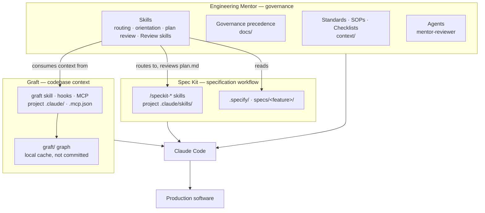
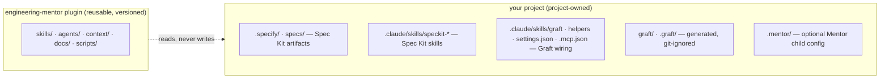
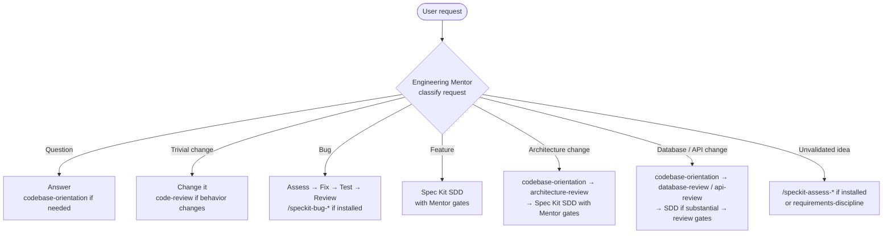
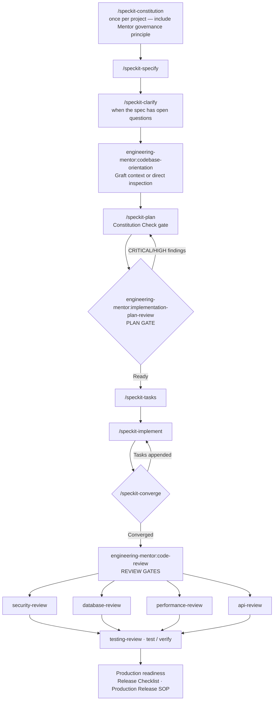

# Engineering Workflow Architecture

Engineering Mentor composes with two external tools, each keeping one responsibility:

| Layer | System | Owns | Answers |
|---|---|---|---|
| Governance | **Engineering Mentor** (this plugin) | Standards, SOPs, review skills, severity taxonomy, governance precedence | *How* should this be engineered, and is it good enough? |
| Specification workflow | **GitHub Spec Kit** ([`docs/integrations/spec-kit.md`](../integrations/spec-kit.md)) | Constitution, spec, plan, tasks, implementation, convergence | *What* is being built, and how is the work structured? |
| Codebase context | **Graft** ([`docs/integrations/graft.md`](../integrations/graft.md)) | Codebase graph, dependency and caller tracing, repository orientation | What does the *existing* code look like, and what does a change touch? |

None of the three contains another's source. Spec Kit and Graft are installed per project by the user; Engineering Mentor is installed as a Claude Code plugin (and an Antigravity plugin) and reads their outputs.

## Where things live

The plugin never stores a project's specifications, plans, or graph. The project owns them and commits what its teams share.

## Request routing

`skills/spec-driven-development/SKILL.md` classifies each request and chooses the lightest safe workflow. Nothing is forced through every phase.

| Request | Workflow |
|---|---|
| "What does this function do?" | Answer; Graft context if useful. No Spec Kit. |
| "Fix the typo in the heading." | Change it. No Spec Kit, no review gate. |
| "Fix this null pointer error." | Assess → fix → test → review. No specification. |
| "Add customer-level pricing." | Specify → clarify → orient → plan → **plan gate** → tasks → implement ⇄ converge → **review gates** → verify. |
| "Split billing out of the monolith." | Orient → architecture review → specify → plan → **plan gate** → tasks → implement → converge → **review gates**. |
| "Add a NOT NULL column to users." | Orient (consumers, writers) → database review with migration safety → testing → production readiness; SDD if substantial. |

## The feature workflow

Owners: `/speckit-*` steps are Spec Kit; `codebase-orientation` draws on Graft; every gate is Engineering Mentor. Domain review gates run only where the change touches their domain.

## Governance rules across the three systems

- **Mentor is the authority for engineering quality.** A Spec Kit plan is reviewed by `implementation-plan-review` for architecture, security, performance, database design, API design, maintainability, observability, testing, backward compatibility, migration safety, and deployment risk. A CRITICAL or HIGH finding sends the plan back to `/speckit-plan`.
- **Spec Kit doesn't override engineering governance.** A spec, plan, or constitution principle never weakens a Mentor Mandatory security or data-integrity requirement (`docs/Governance Precedence Model.md`). Conversely, Mentor doesn't rewrite a spec's requirements; it raises conflicts with the user.
- **Graft is evidence, not authority.** Graft context informs orientation and reviews; facts that change a plan or a severity are verified against source, and Graft context never overrides project requirements.
- **Mentor doesn't modify the external tools.** It reads Spec Kit artifacts and Graft output; it never edits their skills, templates, wiring, or generated files, and never installs or upgrades them.
- **Enforcement through Spec Kit's own mechanism.** A project that adds the Engineering Governance principle to its constitution (`docs/integrations/spec-kit.md` → Constitution) gets the plan gate checked by `/speckit-plan`'s Constitution Check and by `/speckit-analyze`.

## Platform support

| | Claude Code | Antigravity |
|---|---|---|
| Engineering Mentor | Plugin (`.claude-plugin/plugin.json`), skills as `/engineering-mentor:<skill>` | Plugin (`plugin.json`), skills as `/<skill>`, rules from `rules/AGENTS.md` |
| Spec Kit | Official integration: `specify init --integration claude` → `.claude/skills/speckit-*` | Official integration: `specify init --integration agy` → `.agents/skills/speckit-*` |
| Graft | Official deep integration: skill, hooks, statusline, MCP | No dedicated integration; `AGENTS.md` route via `graft init --agents agents --no-global` (unverified) |

The Mentor's new skills are platform-neutral Markdown like every other Mentor skill, so Antigravity picks them up from `skills/` with no adapter changes.

## Why no dedicated workflow agent

A separate `engineering-workflow-reviewer` agent was considered and not added. Routing is done by `spec-driven-development`, and every review is done by an existing Review skill; an agent restating both would be a second source of truth for the same rules. The existing `mentor-reviewer` agent reviews Mentor's own artifacts and is unchanged. Revisit if a fresh-context reviewer for large plans proves necessary in practice.

## Versioning and upgrades

Engineering Mentor pins nothing and bundles nothing from Spec Kit or Graft. Each integration document records the version it was verified against and a supported range. Upgrades of either tool are performed by the user per the tool's own instructions; Mentor maintainers then re-verify the integration document and re-run the tagged evals (`claude plugin eval . --scaffold --tag spec-kit`, `--tag graft`). Because Mentor refers only to documented skill names, artifact paths, and CLI behavior — and leaves Graft's command usage to Graft's own skill — an upstream release changes documentation and routing tables, not Mentor's architecture.
